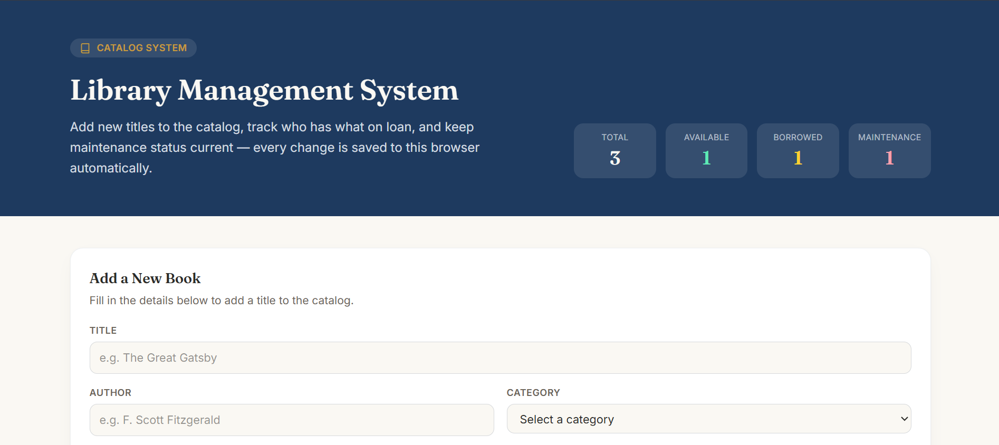
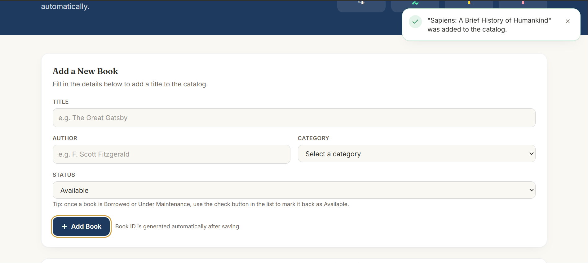
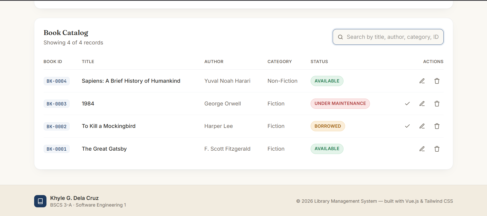
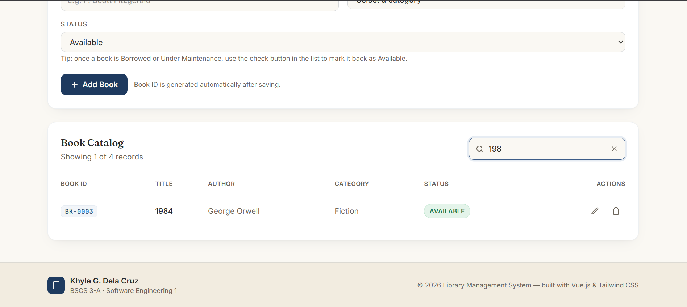
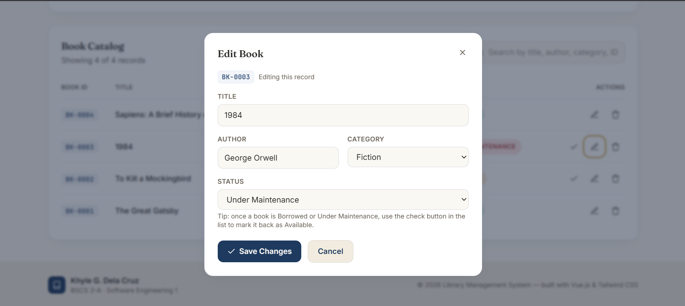
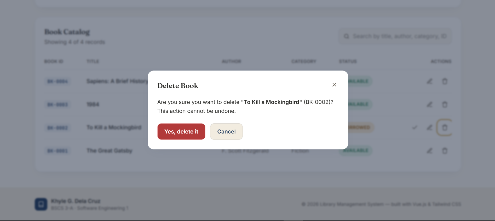
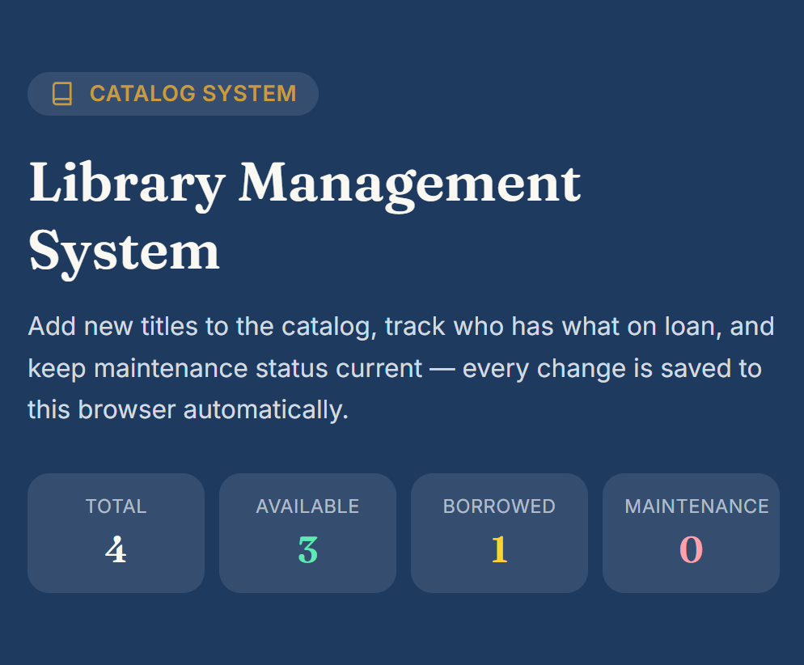

# Library Management System — Book Records Module

## Student Information
- **Name:** Khyle G. Dela Cruz
- **Course and Section:** BSCS 3A
- **Subject:** Software Engineering 1
- **Module:** Module 7 — Frontend Prototype Implementation
- **Instructor:** Patrick Jason L. Torres

---

## System Description
The **Library Management System** is a web-based application designed to digitalize and streamline the tracking of library catalog records. It allows administrators and students to manage book inventories, track availability, and keep records organized in a centralized system, replacing slow and error-prone manual record-keeping.

This repository contains the **Module 7 frontend prototype**, which translates the architecture proposed in Module 6 into a working Vue.js application.

### Selected Module 6 Entity: Books
From the full Library Management System architecture, the **Books** entity was selected for prototyping, since it has clear, well-defined fields and naturally supports Create, Read, Update, Delete, and Search operations.

| Field | Description |
|---|---|
| Book ID | Unique identifier for the book record |
| Title | Title of the book |
| Author | Author of the book |
| Category | Genre or subject classification |
| Status | Availability status (Available, Borrowed, Under Maintenance) |

---

## Implemented Features
- **Add** a new book record through a validated entry form
- **View** all book records in an organized table/card layout
- **Edit** an existing book's details and save the changes
- **Delete** a book record after user confirmation
- **Search** books by title (or other relevant field)
- **Validation** that blocks submission when required fields are empty
- **Persistence** of records in the browser using localStorage, so data survives page refreshes
- Success, warning, and error feedback messages
- Record count / summary display
- Responsive layout for desktop and smaller screen widths
- Application header, navigation, and footer with student name and section

---

## Technologies Used
- **Vue.js** (Vite-based project) — component structure and reactivity
- **Tailwind CSS v4** — utility-first responsive styling
- **JavaScript (ES6+)** — CRUD logic, validation, and state management
- **Browser localStorage** — client-side data persistence
- **Git and GitHub** — version control and collaboration
- **GitHub Actions** — automated production build verification

---

## Installation and Run Instructions

### Prerequisites
Make sure the following are installed and check versions:
```bash
node --version
npm --version
git --version
```

### Setup Steps
1. Clone the repository
   ```bash
   git clone <repository-link>
   cd surname-module7-system
   ```
2. Install dependencies
   ```bash
   npm install
   ```
3. Run the development server
   ```bash
   npm run dev
   ```
4. Open the local address shown in the terminal (e.g. `http://localhost:5173/`) in your browser.

### Build for Production
```bash
npm run build
```

---

## Explanation of localStorage
This prototype simulates a backend/database using the browser's **localStorage**, since a full backend, API, and database are not required at this stage (they remain proposed future components from the Module 6 architecture).

- When the app loads, it checks localStorage for a saved key (`module7-records`). If data exists, it is parsed from JSON and loaded into the app's reactive state (`records`). If not, the app starts with an empty list.
- Every time a record is **added**, **edited**, or **deleted**, the updated `records` array is converted to a JSON string using `JSON.stringify()` and saved back into localStorage under the same key.
- Because the data is stored in the browser rather than in memory only, **records remain available even after the page is refreshed or the browser is closed and reopened**, giving the prototype persistent behavior without needing a real backend.

Example logic used:
```js
// Load on mount
const saved = localStorage.getItem('module7-records')
records.value = saved ? JSON.parse(saved) : []

// Save after any change
localStorage.setItem('module7-records', JSON.stringify(records.value))
```

**Limitation:** localStorage is local to a single browser/device and is not shared across users or devices — this is expected, since it is only a stand-in for the future real database.

---

## Connection Between Module 6 and Module 7

| Module 6 Element | Module 7 Implementation |
|---|---|
| Proposed complete Library Management System | Serves as the basis and long-term architectural blueprint |
| Presentation layer | Implemented using Vue components styled with Tailwind CSS |
| System module/entity (Books) | Implemented as one selected functional prototype |
| User interactions | Built as forms, buttons, record list, and search field |
| Application logic | Implemented as JavaScript CRUD and validation functions |
| Data layer (MongoDB Atlas, proposed) | Simulated using browser localStorage for this prototype |
| Backend/API/Node.js + Express (proposed) | Left as a future implementation; not required for Module 7 |

In short, Module 6 defined **what the full system should look like architecturally**, while Module 7 takes **one piece of that design (Books)** and turns it into a **real, working, testable frontend**, proving that the architecture is implementable while keeping the backend as future scope.

---

## Application Screenshots

The following screenshots demonstrate the main features and responsive behavior of the Library Management System prototype.

### 1. Home Page



### 2. Add Book Form



### 3. Book Records List



### 4. Search Function



### 5. Edit Book Form



### 6. Delete Confirmation



### 7. Responsive / Mobile View



---

## Known Limitations
- Data is stored only in the browser's localStorage, so records are **not shared across different devices or browsers** and can be lost if browser storage/cache is cleared.
- There is **no real backend, API, or database** connected yet — this prototype only simulates persistence.
- **No user authentication or access control** — anyone using the browser can add, edit, or delete records.
- No pagination — large numbers of book records may make the list harder to browse.
- Search currently filters by a single field (e.g., title) rather than multiple fields at once.
- No image or cover upload support for book records.

## Proposed Future Improvements
- Connect the prototype to a real backend (Node.js + Express) and database (MongoDB Atlas) as originally proposed in Module 6.
- Add user authentication and role-based access (Admin vs. Student/Faculty).
- Implement multi-field and advanced search/filter (by author, category, and status simultaneously).
- Add pagination or infinite scroll for large catalogs.
- Add book cover image upload and display.
- Add borrowing/returning workflow with due dates and overdue tracking.
- Deploy the application online (e.g., Vercel/Netlify for frontend, Render/Railway for backend).
- Add automated unit and integration tests alongside the existing GitHub Actions build check.

---
